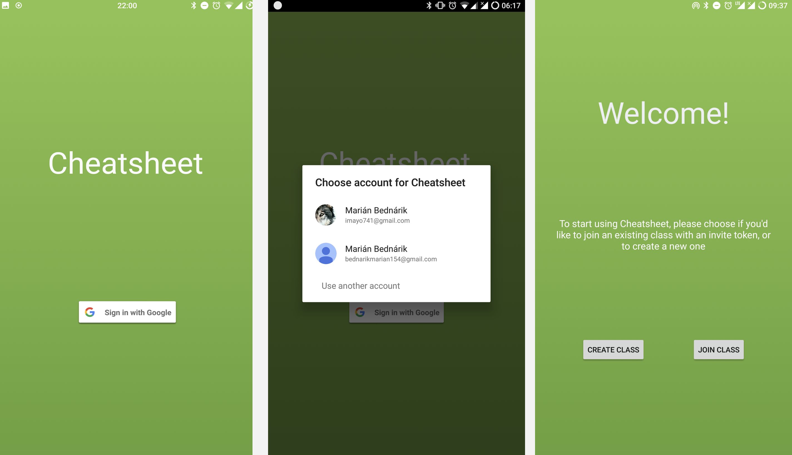
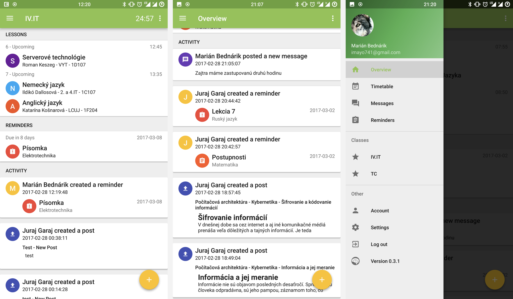
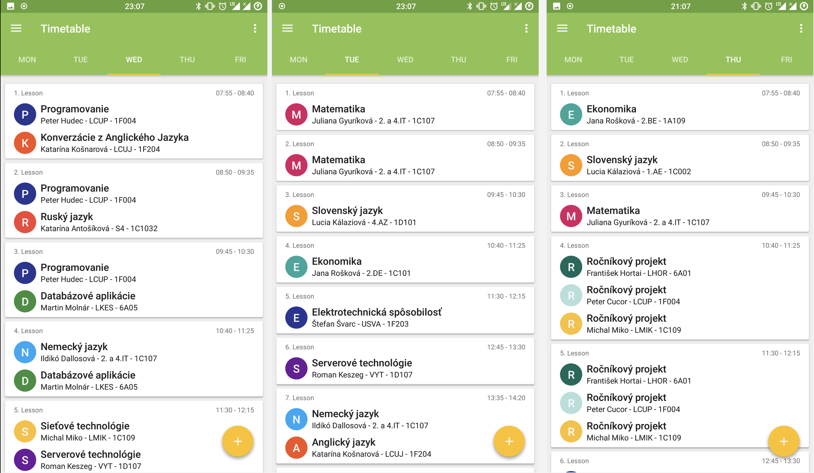
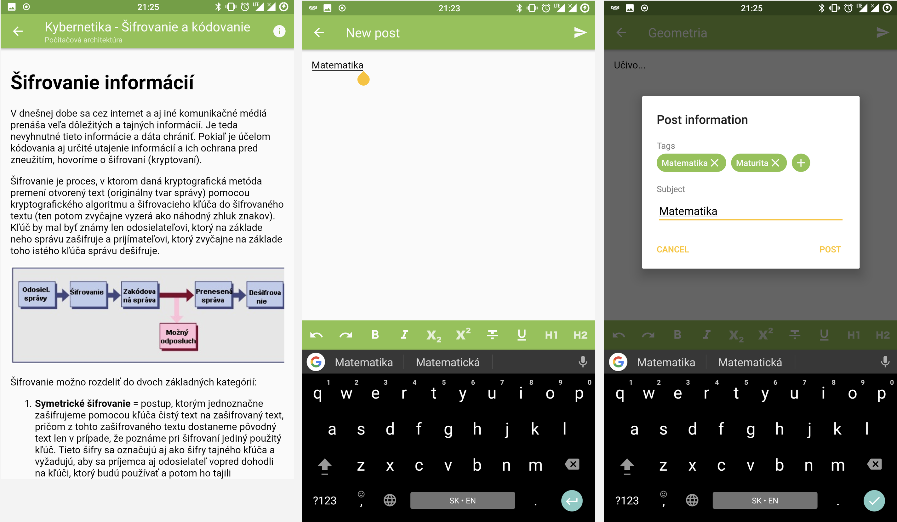
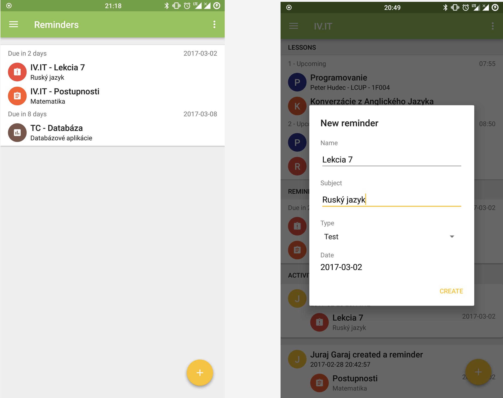
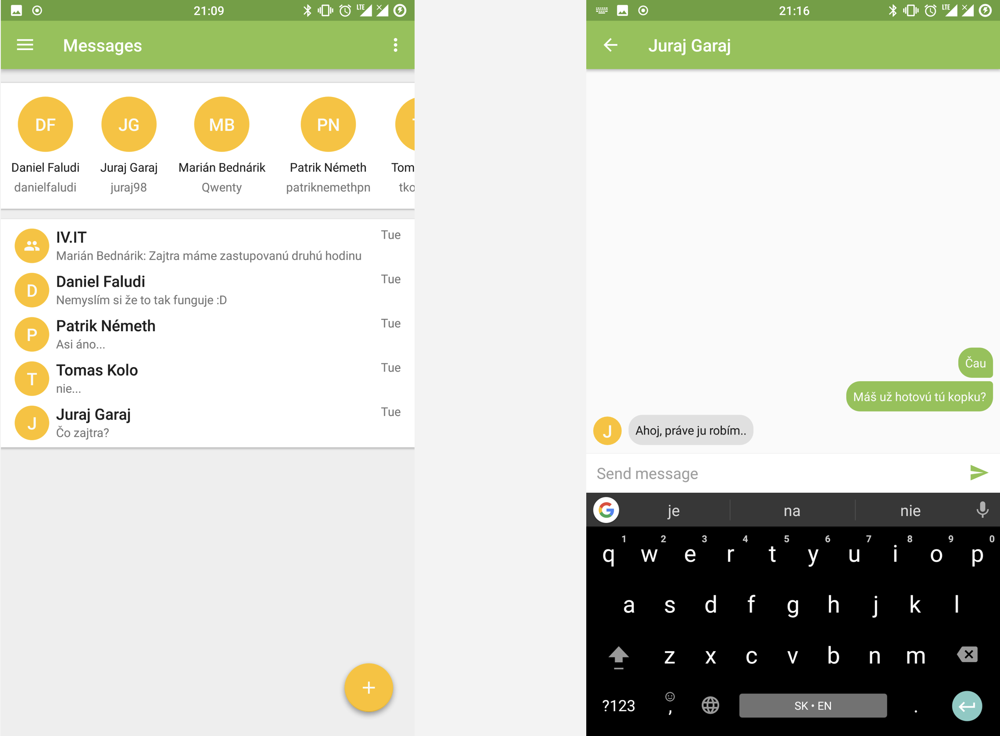

# CheatSheet
An old Android app for my final school project. Won 6th place in the national yearly project competition. It is not great, but hopefully my coding practices have improved from then.

It's supposed to help students organize their school life by aggregating all data from their classes. Think of it as Github for students, where each class has a shared knowledge base of reminders, timetables, notes and _cheatsheets_. Sharing is caring.

This repo serves as more of an archive for documentation purposes, not live/maintained anymore.

## Authentication

Athentication was done by utilizing Google's official auth flow. This allowed us to rapidly develop a secure way of authorizing users, while letting them use their existing account.

## Home screen

The homescreen was designed in a way to provide as much information as possible on what's importatn at the moment. We did't want the user to go through multiple app screens jsut to find what class is next. This allows people to gather a lot of information at a glance, while still allowing them to dive deeper when necessary.

## Timetable

Each class has it's own timetable, created by the owner of the class. This has to be done only once and is then shared amongst all of the classmates, who can make edits and rearrange lessons. Out timetable architecture supported multiple lesson groups with different subjects, as well as arbitrary start and end times with breaks.

## Curriculum notes

All students in a given class can make public or private notes. Public notes would be shared among all other classmates, private notes would be accessible only by the creator. This greatly helps students learn and encourages collaboration.

## Reminders

Reminders serve as ground truth for all upcomming examinations and tests. Created reminders are shared with all classmates, so everyone is informed of upcoming events in time. We also provided periodic notifications before upcoming tests to encourage learning.

## Messaging

Lastly, we provided a way for all members of a class to message eachother, without having to add one another. This can be achieved by using the group chat automatically created for all classes, or by using the direct messaging system for private messages.

